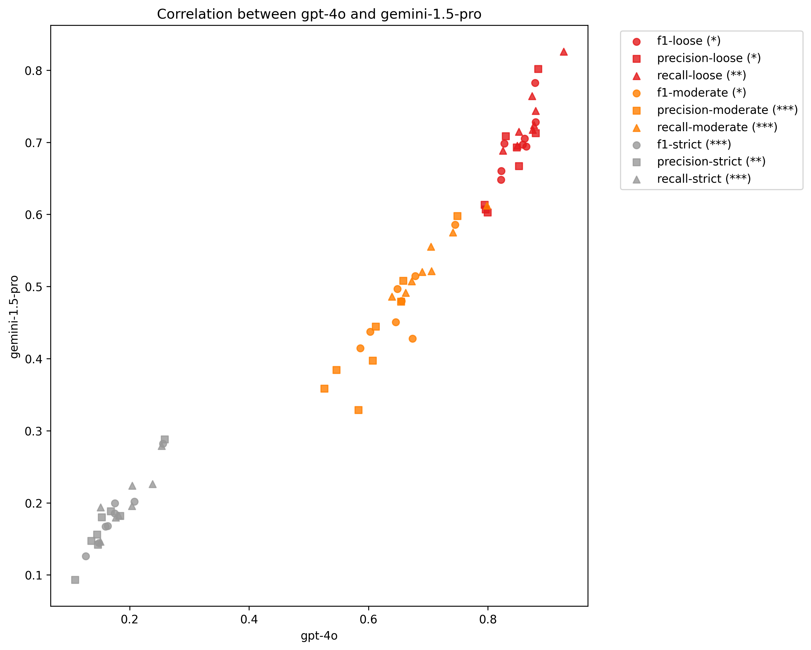

# Additional Details

## Standard error, t-test, and significance

### Persona
| Dataset   | Metric           |   Cot-RAG |   Cot-RAG-SE |   RAG(1) |   RAG(1)-SE |   p-value | Significance   |
|:----------|:-----------------|----------:|-------------:|---------:|------------:|----------:|:---------------|
| Persona   | Atometric-F1 (L) |    0.8394 |       0.0162 |   0.7382 |      0.0215 |    0.0002 | ***            |
| Persona   | Atometric-F1 (M) |    0.5084 |       0.0208 |   0.3142 |      0.0210 |    0.0000 | ***            |
| Persona   | Atometric-F1 (S) |    0.1725 |       0.0126 |   0.0842 |      0.0114 |    0.0000 | ***            |
| Persona   | Atometric-P (M)  |    0.5171 |       0.0207 |   0.3418 |      0.0214 |    0.0000 | ***            |
| Persona   | Atometric-R (M)  |    0.5921 |       0.0210 |   0.4372 |      0.0214 |    0.0000 | ***            |
| Persona   | BERTScore F1     |    0.8948 |       0.0011 |   0.8896 |      0.0012 |    0.0017 | **             |
| Persona   | BLEURT Scores    |    0.4578 |       0.0059 |   0.4223 |      0.0060 |    0.0000 | ***            |
| Persona   | METEOR           |    0.3058 |       0.0090 |   0.2529 |      0.0082 |    0.0000 | ***            |
| Persona   | ROUGE-2          |    0.1043 |       0.0058 |   0.0779 |      0.0055 |    0.0010 | **             |

### Red Teaming Strategies
| Dataset                | Metric           |   Cot-RAG |   Cot-RAG-SE |   RAG(1) |   RAG(1)-SE |   p-value | Significance   |
|:-----------------------|:-----------------|----------:|-------------:|---------:|------------:|----------:|:---------------|
| Red Teaming Strategies | Atometric-F1 (L) |    0.6366 |       0.0185 |   0.5390 |      0.0195 |    0.0003 | ***            |
| Red Teaming Strategies | Atometric-F1 (M) |    0.4614 |       0.0173 |   0.3173 |      0.0170 |    0.0000 | ***            |
| Red Teaming Strategies | Atometric-F1 (S) |    0.1542 |       0.0116 |   0.0838 |      0.0087 |    0.0000 | ***            |
| Red Teaming Strategies | Atometric-P (M)  |    0.4574 |       0.0179 |   0.2997 |      0.0162 |    0.0000 | ***            |
| Red Teaming Strategies | Atometric-R (M)  |    0.5372 |       0.0170 |   0.4701 |      0.0173 |    0.0059 | **             |
| Red Teaming Strategies | BERTScore F1     |    0.9020 |       0.0010 |   0.8952 |      0.0011 |    0.0000 | ***            |
| Red Teaming Strategies | BLEURT Scores    |    0.4415 |       0.0036 |   0.4079 |      0.0041 |    0.0000 | ***            |
| Red Teaming Strategies | METEOR           |    0.4305 |       0.0059 |   0.3624 |      0.0061 |    0.0000 | ***            |
| Red Teaming Strategies | ROUGE-2          |    0.2463 |       0.0052 |   0.2260 |      0.0051 |    0.0056 | **             |

### Research Idea
| Dataset       | Metric           |   Cot-RAG |   Cot-RAG-SE |   RAG(1) |   RAG(1)-SE |   p-value | Significance   |
|:--------------|:-----------------|----------:|-------------:|---------:|------------:|----------:|:---------------|
| Research Idea | Atometric-F1 (L) |    0.4869 |       0.0152 |   0.4885 |      0.0156 |    0.9391 |                |
| Research Idea | Atometric-F1 (M) |    0.1757 |       0.0100 |   0.1620 |      0.0103 |    0.3396 |                |
| Research Idea | Atometric-F1 (S) |    0.0762 |       0.0053 |   0.0777 |      0.0059 |    0.8507 |                |
| Research Idea | Atometric-P (M)  |    0.2137 |       0.0112 |   0.2362 |      0.0130 |    0.1899 |                |
| Research Idea | Atometric-R (M)  |    0.2030 |       0.0113 |   0.1710 |      0.0105 |    0.0392 | *              |
| Research Idea | BERTScore F1     |    0.8600 |       0.0008 |   0.8642 |      0.0009 |    0.0005 | ***            |
| Research Idea | BLEURT Scores    |    0.3671 |       0.0030 |   0.3447 |      0.0038 |    0.0000 | ***            |
| Research Idea | METEOR           |    0.1976 |       0.0040 |   0.1425 |      0.0040 |    0.0000 | ***            |
| Research Idea | ROUGE-2          |    0.0408 |       0.0024 |   0.0304 |      0.0024 |    0.0020 | **             |

### Research Context (Text)
| Dataset                 | Metric           |   Cot-RAG |   Cot-RAG-SE |   RAG(1) |   RAG(1)-SE |   p-value | Significance   |
|:------------------------|:-----------------|----------:|-------------:|---------:|------------:|----------:|:---------------|
| Research Context (Text) | Atometric-F1 (L) |    0.5489 |       0.0214 |   0.4732 |      0.0227 |    0.0156 | *              |
| Research Context (Text) | Atometric-F1 (M) |    0.0873 |       0.0091 |   0.0650 |      0.0086 |    0.0754 |                |
| Research Context (Text) | Atometric-F1 (S) |    0.0349 |       0.0055 |   0.0263 |      0.0047 |    0.2353 |                |
| Research Context (Text) | Atometric-P (M)  |    0.1684 |       0.0119 |   0.1204 |      0.0120 |    0.0046 | **             |
| Research Context (Text) | Atometric-R (M)  |    0.1023 |       0.0103 |   0.0867 |      0.0095 |    0.2666 |                |
| Research Context (Text) | BERTScore F1     |    0.8668 |       0.0010 |   0.8663 |      0.0010 |    0.7055 |                |
| Research Context (Text) | BLEURT Scores    |    0.3342 |       0.0044 |   0.3322 |      0.0041 |    0.7350 |                |
| Research Context (Text) | METEOR           |    0.1699 |       0.0051 |   0.1492 |      0.0049 |    0.0037 | **             |
| Research Context (Text) | ROUGE-2          |    0.0433 |       0.0031 |   0.0375 |      0.0031 |    0.1793 |                |

### Research Context (Network)
| Dataset                    | Metric           |   Cot-RAG |   Cot-RAG-SE |   RAG(1) |   RAG(1)-SE |   p-value | Significance   |
|:---------------------------|:-----------------|----------:|-------------:|---------:|------------:|----------:|:---------------|
| Research Context (Network) | Atometric-F1 (L) |    0.4669 |       0.0231 |   0.3549 |      0.0230 |    0.0006 | ***            |
| Research Context (Network) | Atometric-F1 (M) |    0.0476 |       0.0087 |   0.0251 |      0.0063 |    0.0372 | *              |
| Research Context (Network) | Atometric-F1 (S) |    0.0129 |       0.0036 |   0.0037 |      0.0019 |    0.0258 | *              |
| Research Context (Network) | Atometric-P (M)  |    0.1190 |       0.0136 |   0.0722 |      0.0114 |    0.0085 | **             |
| Research Context (Network) | Atometric-R (M)  |    0.0720 |       0.0101 |   0.0404 |      0.0069 |    0.0106 | *              |
| Research Context (Network) | BERTScore F1     |    0.8620 |       0.0009 |   0.8604 |      0.0010 |    0.2504 |                |
| Research Context (Network) | BLEURT Scores    |    0.3057 |       0.0044 |   0.2978 |      0.0044 |    0.2004 |                |
| Research Context (Network) | METEOR           |    0.1309 |       0.0042 |   0.1041 |      0.0038 |    0.0000 | ***            |
| Research Context (Network) | ROUGE-2          |    0.0251 |       0.0026 |   0.0215 |      0.0026 |    0.3164 |                |

## Rank correlation between two different LLM evaluators

|    | Level    | Metric    |   Spearman's rho |   p-value | Significance   |
|---:|:---------|:----------|-----------------:|----------:|:---------------|
|  0 | loose    | f1        |            0.810 |     0.015 | *              |
|  1 | loose    | precision |            0.810 |     0.015 | *              |
|  2 | loose    | recall    |            0.857 |     0.007 | **             |
|  3 | moderate | f1        |            0.738 |     0.037 | *              |
|  4 | moderate | precision |            0.929 |     0.001 | ***            |
|  5 | moderate | recall    |            0.976 |     0.000 | ***            |
|  6 | strict   | f1        |            1.000 |     0.000 | ***            |
|  7 | strict   | precision |            0.905 |     0.002 | **             |
|  8 | strict   | recall    |            0.929 |     0.001 | ***            |
